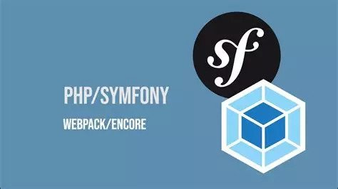

[](https://www.codacy.com?utm_source=gitlab.com&utm_medium=referral&utm_content=ron2cuba/snowtricks&utm_campaign=Badge_Grade)
[](https://gitlab.com/ron2cuba/p6_snowtricks)

# Snowtricks

Pourquoi deux repository ?

Pour vous permettre de suivre la timeline de tous le commits car dans la premiere
version j'ai rencontré un souci avec le versioning de la base de donnée du à :

```bash
git reset --hard
```
## Installation
L'insatllation du projet et de ses dépendances se fait grâce aux commandes :

```bash
composer install
# puis
npm i
```
dans un outil comme [phpMyAdmin](https://www.phpmyadmin.net/downloads/) que l'on
retourve par exemple dans [Wamp](https://www.wampserver.com/) | [Xampp](https://www.apachefriends.org/download.html) |
[LAMP](https://doc.ubuntu-fr.org/lamp) | [MAMP](https://www.mamp.info/en/downloads/) :
Se créer une base de donnée et la nommer `snowtricks` ou dans votre console lancer 
la commande :
```bash
php bin/console doctrine:database:create
```
Vérifier au préalable que le fichier `.env` à la racine du projet est correctement
renseigné.

DATABASE_URL="mysql://<u>"userMysql"</u>:<u>"Mot de Passe"</u>@127.0.0.1:3306/<u>"nom de la base"</u>?serverVersion=8&charset=utf8mb4"

Lancer ensuite les migrations pour créer les colonnes de la base de donnée Mysql:

```bash
doctrine:migrations:migrate
```

Lancer les fixtures, pour la peupler avec quelques data grâce au
[Doctrine Fixtures Bundle](https://symfony.com/bundles/DoctrineFixturesBundle/current/index.html)
faisant partie des dependances

```bash
php bin/console doctrine:fixtures:load
``` 

## Outils

Requirements | Nom | - |
 --- | --- | --- |
 | PHP | v8.1
| Composer | v2.4.1
| Symfony | v6.1
| NPM | v8.17.0

## Assets management



Les Assets sont gérés avec le Bundle WebpackEncore qui est une intégration de
Webpack pour Symfony.

Les commandes suivantes peuvent être utilisées :
```bash
# compilation unique
npm run build
# compilation sur un server
npm run dev
# compilation avec refresh du navigateur
npm run dev-server
# écoute de modification
npm run watch
```

Les commandes sont disponilbles dans le fichier `package.json`
```json
"scripts": {
        "dev-server": "encore dev-server",
        "dev": "encore dev",
        "watch": "encore dev --watch",
        "build": "encore production --progress"
    },
```

Le micro framework css [`picocss`](https://picocss.com/) est importé comme
dépendances grâce à NPM tout comme [SassLoader](https://webpack.js.org/loaders/sass-loader/)
et [WebpackEncore](https://symfony.com/doc/current/frontend.html)